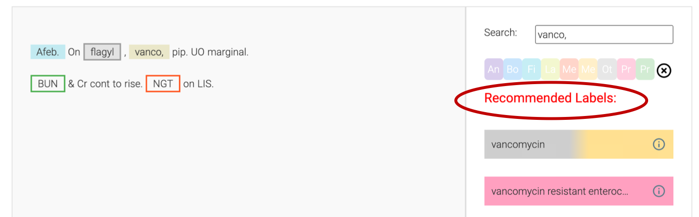
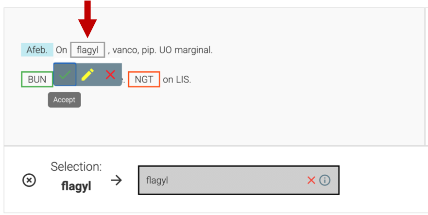
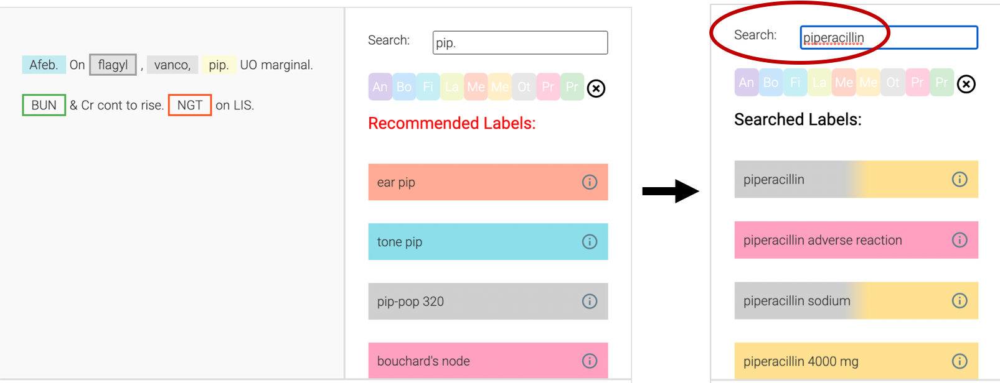
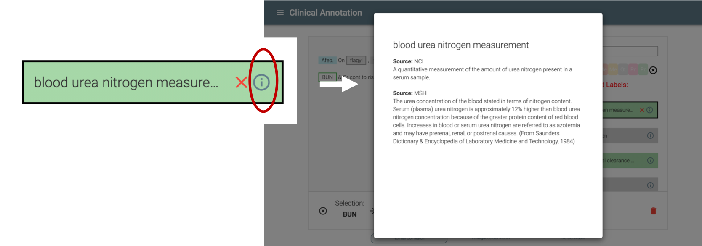
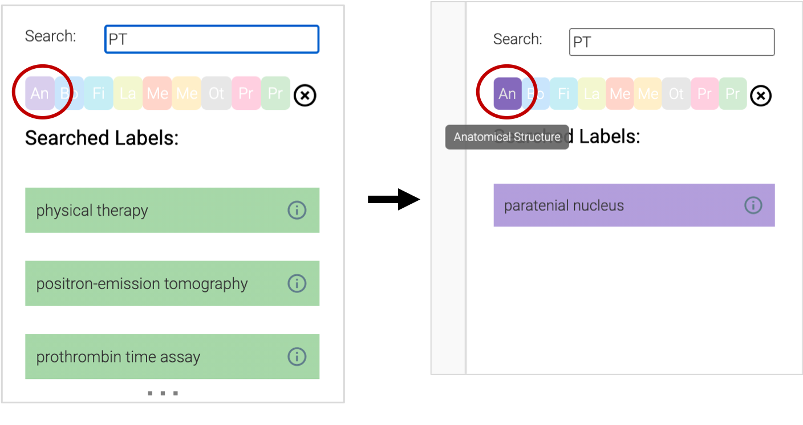
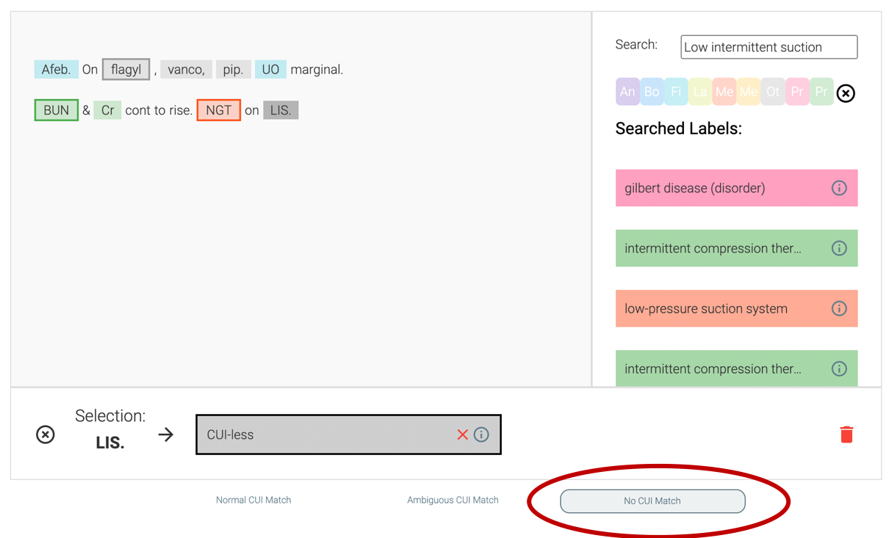

##  Overview
Our platform enables the rapid annotation of medical terms within clinical notes. A user can highlight spans of text and quickly map them to concepts in large vocabularies within a single, intuitive platform. Users can use the search and recommendation features to find labels without ever needing to leave the interface. Further, the platform can take in output from existing clinical concept extraction systems as pre-annotations, which users can accept or modify in a single click. These features allow users to focus their time and energy on harder examples instead. See the demo below!

<video controls="controls" width="500" height="300" name="Demo" src="files/annotator_demo.mov"></video>

## Why?
Clinical notes document detailed patient information, including pertinent medical history, procedures performed during a visit, and response to treatment. This information can be leveraged for a variety of use cases--from more personalized decision support in electronic health record to richer retrospective research. 

However, this data often exists only in clinical text, and not in any structured fields; therefore, many use cases involve manual or automated structuring of relevant concepts from clinical notes. Current automated approaches of extracting structured clinical concepts are insufficiently robust for many downstream uses, and there isn't much annotated training data publicly available. The goal of our platform is to make that annotation process easier and faster: whether for manual curation, or for the creation of general training data.

       
##  Features
### Recommendations

### Pre-Annotations

### Search

### UMLS Linking

### Concept Categories

### Flexible Annotation

## How to Use
### Installation Instructions
### Loading in Data
### Creating Custom Vocabulary
